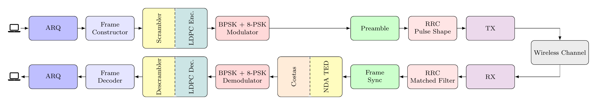
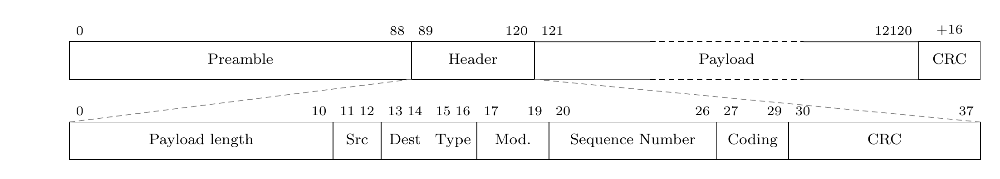

# Radiokommunikasjon

Layer-1/2 radio link on ADALM-Pluto SDRs, exposed to Linux as a TUN
interface. Runs in the 2.4 GHz ISM band with a self-built helix antenna,
and carries unmodified TCP/UDP traffic — SSH, iperf, 1080p H.265 video,
live webcam call.

<p align="center">
  
</p>

NTNU course project (TTT4145), 2026. Authors: Kim Hamberg, Mathias Huse,
Morten Sørensen — Department of Electronic Systems. The full write-up is
in [`report/Radiokommunikasjon.pdf`](report/Radiokommunikasjon.pdf).

## Performance

| | |
|---|---|
| UDP throughput (8-PSK, LDPC R=5/6) | 2.98 Mbit/s |
| Post-ARQ packet error rate | 0.67 % |
| Ping (avg / max) | 69 ms / 86 ms |
| RMS EVM at 3 m | 2.6 % |
| Eb/N0 at 3 m | 31.7 dB |
| 99 % occupied bandwidth | 1.84 MHz (ETSI EN 300 328 compliant) |
| Helix antenna gain | 10.5 dBi @ 2.478 GHz |

## Parameters

| | |
|---|---|
| Band | 2.4 GHz ISM (2.405 – 2.478 GHz) |
| Sample rate | 6 MS/s |
| Samples / symbol | 4 |
| Symbol rate | 1.5 Msym/s |
| Pulse shape | RRC, span 8, roll-off 0.25 |
| Header | BPSK, uncoded, CRC-8 |
| Payload | 8-PSK, LDPC (1/2, 2/3, 3/4, 5/6), block 1944 bit |
| LDPC decoder | normalised soft min-sum, α = 0.75 |
| Preamble | Zadoff-Chu, root 13, length 89 |
| Symbol timing | non-data-aided TED (Rice 2009) |
| Carrier phase | Costas loop (BPSK / QPSK / 8-PSK) |
| ARQ | Selective Repeat, window 63 |

The DSP blocks are Python with pybind11 C++ extensions on the hot paths;
pure-Python fallbacks remain in place if an extension fails to import.
Frame sync is a full-buffer normalised cross-correlation against the
Zadoff-Chu preamble — peaks above 0.3 are accepted, and the correlation
phase seeds the Costas loop so it never has to acquire blind.

## Frame format

<p align="center">
  
</p>

`type` ∈ {DATA, ACK, RAW (UDP, ARQ-bypass), CTRL}. Payload integrity is
checked via CRC-16-CCITT (poly 0x1021). ACK frames are zero-length, BPSK,
uncoded, and carry a SACK bitmap covering the window past the cumulative
ACK.

## Layout

```
modules/    DSP blocks (Python + pybind11 C++)
  pulse_shaping/      RRC, upsample, match filter
  modulators/         BPSK / QPSK / 8-PSK / 16-PSK
  frame_constructor/  header / payload + CRCs
  frame_sync/         Schmidl-Cox coarse + ZC fine
  costas_loop/        carrier-phase recovery
  nda_ted/            symbol timing (Rice 2009)
  ldpc/               IEEE 802.11 LDPC en/decode
  arq.py              Selective-Repeat ARQ
  tun.py              Linux TUN plumbing
  pipeline.py         TX/RX entry point
pluto/      Pluto runners (one_way_threaded.py, tun_link.py, ...)
scripts/    sweeps, calibration, capture replay, video streaming
tests/      pytest suite (test_stress is slow)
report/     project report + diagram sources
vendor/     bundled deps
```

## Build

Needs Python 3.14+ and `uv`.

```
uv sync                # install deps, build all C++ extensions
uv sync --reinstall    # rerun after editing .cpp / .h
```

## Run

```
uv run pytest                  # full test suite
uv run pytest -k 'not stress'  # skip slow stress tests

# one-way link, single Pluto per side
uv run python pluto/one_way_threaded.py --mode rx     # node B
uv run python pluto/one_way_threaded.py --mode tx     # node A

# full-duplex TUN link (two Plutos per host, libiio limit)
sudo scripts/oneway_netns.sh

# parameter sweeps over recorded RX captures
uv run python pluto/one_way_threaded.py --mode rx --save-rx-buf rx_dump --save-n 4
uv run python scripts/sweep_costas_params.py rx_dump --plot
uv run python scripts/sweep_nda_ted_params.py rx_dump --plot
uv run python scripts/sweep_costas_params.py rx_dump --with-nda-ted --plot
```

To rebuild the README diagrams from their LaTeX sources:

```
report/build.sh        # writes report/{pipeline,frame_format}.png
```

## Limitations

- Single Pluto can't do full duplex over USB 2.0 — two are needed per host
- Pluto TX power falls short of the datasheet, so the link budget is
  re-derived from measured EIRP
- A short boot-time RF burst can exceed the 2.4 GHz PSD limit on some
  units while the AD9361 is being configured
